```mermaid 
pie title Password Requirements
    "Length ≥8" : 15
    "Upper+Lower Case" : 15
    "Digits" : 15
    "Special Chars" : 15
    "No Spaces" : 10
    "No Common Passwords" : 20
    "Max 2 Repeats" : 10
```

# 🔒 Password Authentication System with PostgreSQL and Python

<p align="center">
  
</p>

A secure authentication system combining Python's bcrypt hashing with PostgreSQL for cloud-ready user management. Features Gradio UI and runs seamlessly in Google Colab.

## 🌟 Features

- ✅ **Zero Trust Design**: 8-point password validation
- 🔐 **Military-Grade Security**: BCrypt + salt hashing
- 🗄️ **Cloud-Native**: PostgreSQL via Neon.tech
- 🧪 **Colab-Ready**: Jupyter notebook included
- 🖥️ **User-Friendly**: Gradio web interface


## 🚀 Getting Started
Prerequisites
PostgreSQL database (PGAdmin recommended)

Google account for Colab access

⚡ Quick Setup
``` python
!pip install bcrypt psycopg2-binary gradio
```

Import the Colab notebook

Configure your Neon.tech credentials

Run all cells to activate the Gradio UI

